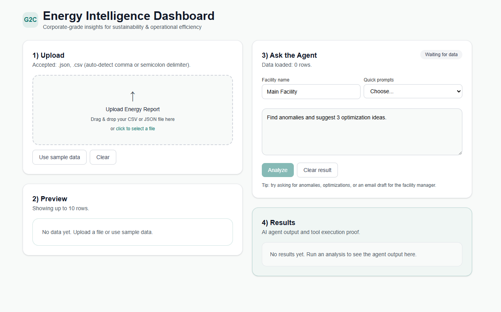
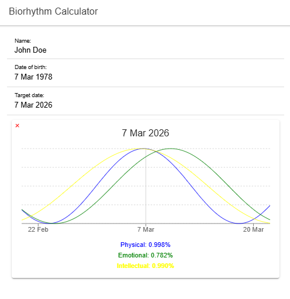

# Hi, I'm Adriana 👋

Frontend Engineer specializing in **modern web applications and scalable UI systems**.

I enjoy creating **modern user interfaces, scalable frontend architecture, and exploring AI-assisted development workflows**.

---

# 🔥 Contribution Activity

---

# 🧪 Technical Assessments

<table>
<tr>
<td width="50%">

### AI Energy Report Analyzer

Technical challenge focused on building an **AI-assisted interface** to analyze energy consumption reports and generate executive insights.

**Features**

- AI-generated executive summaries  
- Energy anomaly detection  
- Automated email draft generation  
- Interactive energy analysis UI  

**Tech Stack**

Next.js • React • TypeScript • OpenAI API • Vercel

🔗 **Live Demo**  
https://g2-c-challenge.vercel.app/

📂 **Repository**  
https://github.com/AdrianaAC/G2C_Challenge

</td>

<td width="50%">
<b>Application Interface</b>

</td>
</tr>

<tr>
<td width="50%">

### LTP Labs Frontend Assessment

Frontend challenge focused on building a **modern e-commerce interface** based on a Figma design.

**Features**

- Product listing and filtering  
- Product detail pages  
- Responsive layout  
- Component-based structure  
- Focus on UI/UX consistency  

**Tech Stack**

React • TypeScript • CSS

🔗 **Live Demo**  
https://adrianaac.github.io/frontend-assessment-LTPLabs/

📂 **Repository**  
https://github.com/AdrianaAC/frontend-assessment-LTPLabs

</td>

<td width="50%">
<b>Application Interface</b>
PLACEHOLDER FOR GIF
</td>
</tr>

<tr>
<td width="50%">

### Internal Automation Workflow

Frontend challenge focused on **internal tool workflows and structured UI for AI-assisted processes**.

**Features**

- Workflow orchestration UI  
- Approval step before final actions  
- Structured state and result handling  
- Clear separation between AI output and user decisions  

**Tech Stack**

Next.js • React • TypeScript • TailwindCSS • Zod

📂 **Repository**  
https://github.com/AdrianaAC/frontend-assessment-internal-automation

</td>

<td width="50%">
<b>Application Interface</b>
PLACEHOLDER FOR GIF
</td>
</tr>

</table>
---

# 🚀 Selected Projects

<table>
<tr>
<td width="50%">

### Ticket Forge

AI-powered developer tool that **extracts structured tickets from screenshots** and converts them into clean, validated ticket objects ready for development workflows.

The system uses **Vision AI + schema validation + normalization** to transform messy ticket screenshots into structured data developers can immediately work with.

**Features**

- AI-powered ticket extraction from screenshots  
- Vision model analysis of Jira/GitHub tickets  
- Schema validation with Zod  
- Ticket normalization and field standardization  
- Missing field detection  
- Human-in-the-loop review interface  

**Tech Stack**

Next.js • React • TypeScript • OpenAI Vision • Zod • TailwindCSS

📂 **Repository**  
https://github.com/AdrianaAC/ticket-forge

</td>

<td width="50%">
<b>Application Demo</b>

</td>
</tr>

<tr>
<td width="50%">

### React Burger Builder

Interactive React application where users can **build a custom burger by adding or removing ingredients dynamically**.

The UI updates in real time and calculates the total price based on the selected ingredients.

**Features**

- Add and remove burger ingredients  
- Real-time UI updates  
- Dynamic ingredient price calculation  
- Global state management with Redux  
- Modular React component architecture  

**Tech Stack**

React • Redux • React Router • Vite • JavaScript • CSS

🔗 **Live Demo**  
https://react-burger-builder-mu.vercel.app/

📂 **Repository**  
https://github.com/AdrianaAC/react-burger-builder

</td>

<td width="50%">
<b>Application Interface</b>

</td>
</tr>

<tr>
<td width="50%">

### Ionic Biorhythm Calculator

Interactive Ionic + Angular application that calculates a user's **physical, emotional, and intellectual biorhythm cycles** based on their birth date.

The application dynamically computes the cycles and displays them visually, providing an intuitive way to explore biorhythm theory.

**Features**

- Calculate biorhythm cycles based on birth date  
- Visual representation of physical, emotional, and intellectual cycles  
- Dynamic cycle calculation  
- Responsive mobile-friendly UI  
- Simple and intuitive user experience  

**Tech Stack**

Ionic • Angular • TypeScript • HTML • CSS • Vercel

🔗 **Live Demo**  
https://ionic-biorhythm-calculator.vercel.app/

📂 **Repository**  
https://github.com/AdrianaAC/ionic-biorhythm-calculator

</td>

<td width="50%">
<b>Application Interface</b>

</td>
</tr>
</table>

---

# 🚀 Tech Stack

### Frontend

- 
- 
- 
- JavaScript (ES6+)

### UI & Styling

- 
- 
- CSS Modules
- SASS
- Responsive Design
- Accessibility (WCAG)

### Data & APIs

- REST APIs
- Axios
- 
- API Integration

### Testing & Performance

- Jest
- Unit Testing
- Lazy Loading
- Performance Optimization
- Component Architecture

### Tooling & DevOps

- Git
- Azure DevOps
- Storybook
- Webpack
- Vercel
- Figma
- Jira
- Agile / Scrum

### AI-Assisted Development

- 
- 
- 
- 

---

# 💼 Professional Experience

I have worked on **enterprise digital platforms across healthcare, retail and industrial sectors**, contributing to scalable frontend systems used by thousands of users.

My work includes:

- Developing **React and Next.js applications**
- Building reusable **UI component systems**
- Integrating complex **REST APIs**
- Improving **frontend architecture and maintainability**
- Implementing **accessible and responsive interfaces**
- Exploring **AI-powered UI features**

---

# 🧠 Currently Learning

- AI-powered frontend interfaces
- Advanced Next.js architecture
- AI-assisted developer workflows

---

# 🌍 Connect with Me

**LinkedIn**  
https://linkedin.com/in/adrianaalves098

**GitHub**  
https://github.com/AdrianaAC

---

✨ Always curious, always building.
